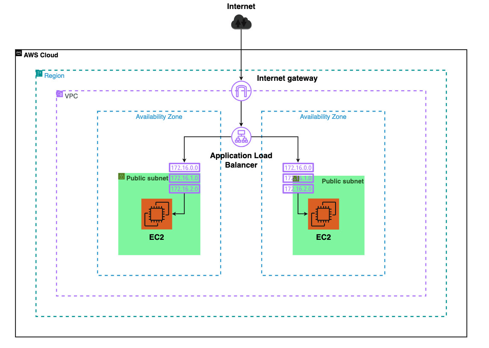
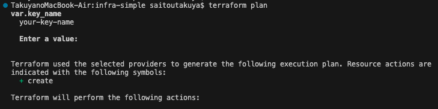

# AWS Infrastructure with Terraform

## 概要
このリポジトリは、Terraformを用いてAWS上にNginx Webサーバーを構築するポートフォリオです。IaCスキルとAWSの基本構成に関する理解をアピールする目的で作成しました。

- **目的**: IaCスキルとAWSネットワーク構成の理解を示すためのポートフォリオ  
- **対象者**: SRE・インフラエンジニア職志望（障がい者雇用枠含む）

---

## インフラ構成

| リソース         | 内容                                       |
|------------------|--------------------------------------------|
| VPC              | カスタムVPC（CIDR: `10.0.0.0/16`）          |
| Subnet           | パブリックサブネット ×2（AZ: `a`, `c`）     |
| Internet Gateway | パブリックサブネットに接続                |
| Route Table      | 0.0.0.0/0 向けのIGWルート設定              |
| Security Group   | HTTP(80), SSH(22) を許可                   |
| EC2              | Amazon Linux 2（Nginxインストール済み）    |
| ALB              | パブリックサブネットに配置し、EC2を登録   |

---

## 使用技術

- Terraform v1.x
- AWS（EC2 / VPC / ALB / SG など）
- Amazon Linux 2
- Nginx

---

## 構成図

## デプロイ手順
# 1. terraform init
以下は `terraform init` を実行した際のスクリーンショットです。初期化が正常に完了したことが確認できます。

# 2. terraform plan
以下は `terraform plan` を実行した際の出力結果です。キーペア名（`var.key_name`）を入力するプロンプトが表示されました。
ここで、使用したい EC2 キーペア名を入力すると、Terraform はリソース作成の計画を出力します。
その後、表示される計画の一部です（`+ create` は作成予定のリソース）

## Terraform plan実行結果について
本リポジトリに含まれるTerraformの実行計画（plan）の主要な出力結果は、こちらのREADMEにて必要な部分のみ抜粋して記載しています。  
より詳細な出力内容につきましては、同梱の「plan-result.txt」ファイルに保存しておりますので、そちらをご参照ください。:
[plan-result.txt](./plan-result.txt)

# 3. 出力されたALBのDNS名にアクセス
