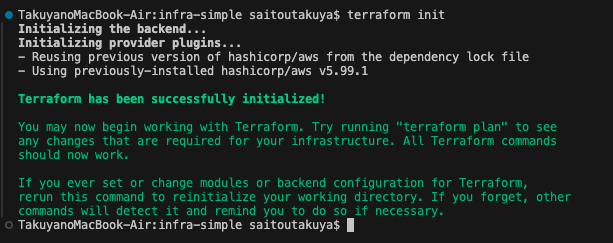
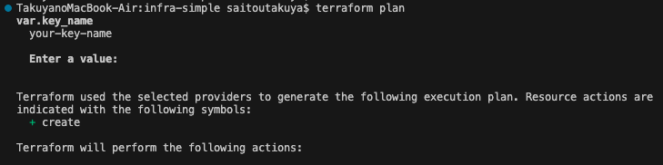

# プロジェクト名
AWS Infrastructure with Terraform

## 概要
このリポジトリは、Terraformを用いてAWS環境を自動構築するポートフォリオです。  
主に以下の構成で、シンプルなWebサーバー環境（Nginx）をデプロイしています。

-**目的**: IaCスキルとAWSネットワーク構成の理解を示すためのポートフォリオ
-**対象者**: SRE・インフラエンジニア職志望（障がい者雇用枠含む）

---

## 構成図

 <!-- 構成図ファイルへのパス -->

---

## インフラ構成

| リソース | 内容 |
|----------|------|
| VPC | カスタムVPC（CIDR: `10.0.0.0/16`） |
| Subnet | Public Subnet × 2（AZ: `a`, `c`） |
| Internet Gateway | パブリックサブネットに接続 |
| Route Table | 0.0.0.0/0 向けにIGWルート設定 |
| Security Group | HTTP(80), SSH(22) を許可 |
| EC2 | Amazon Linux 2 / Nginx 起動スクリプト付 |
| ALB | Public Subnet ×2 に配置。EC2をターゲット登録 |

---

## 使用技術

- Terraform v1.x
- AWS EC2 / VPC / ALB / SG など
- Amazon Linux 2
- Nginx

---

## デプロイ手順
# 1. terraform init
以下は `terraform init` を実行した際のスクリーンショットです。初期化が正常に完了したことが確認できます。

# 2. terraform plan
以下は `terraform plan` を実行した際の出力結果です。Terraform が作成しようとしているリソース（差分）が表示されています。

    aws_instance.web will be created
  + resource "aws_instance" "web" {
      + ami                                  = "ami-0c3fd0f5d33134a76"
      + arn                                  = (known after apply)
      + associate_public_ip_address          = true
      + availability_zone                    = (known after apply)
      + cpu_core_count                       = (known after apply)
      + cpu_threads_per_core                 = (known after apply)
      + disable_api_stop                     = (known after apply)
      + disable_api_termination              = (known after apply)
      + ebs_optimized                        = (known after apply)
      + enable_primary_ipv6                  = (known after apply)
      + get_password_data                    = false
      + host_id                              = (known after apply)
      + host_resource_group_arn              = (known after apply)
      + iam_instance_profile                 = (known after apply)
      + id                                   = (known after apply)
      + instance_initiated_shutdown_behavior = (known after apply)
      + instance_lifecycle                   = (known after apply)
      + instance_state                       = (known after apply)
      + instance_type                        = "t2.micro"
      + ipv6_address_count                   = (known after apply)
      + ipv6_addresses                       = (known after apply)
      + key_name                             = (known after apply)
      + monitoring                           = (known after apply)
      + outpost_arn                          = (known after apply)
      + password_data                        = (known after apply)
      + placement_group                      = (known after apply)
      + placement_partition_number           = (known after apply)
      + primary_network_interface_id         = (known after apply)
      + private_dns                          = (known after apply)
      + private_ip                           = (known after apply)
      + public_dns                           = (known after apply)
      + public_ip                            = (known after apply)
      + secondary_private_ips                = (known after apply)
      + security_groups                      = (known after apply)
      + source_dest_check                    = true
      + spot_instance_request_id             = (known after apply)
      + subnet_id                            = (known after apply)
      + tags                                 = {
          + "Name" = "sre-demo-ec2"
        }
      + tags_all                             = {
          + "Name" = "sre-demo-ec2"
        }
      + tenancy                              = (known after apply)
      + user_data                            = "b7ae7d432513168fe0310c5e3e57307300749c5a"
      + user_data_base64                     = (known after apply)
      + user_data_replace_on_change          = false
      + vpc_security_group_ids               = (known after apply)

      + capacity_reservation_specification (known after apply)

      + cpu_options (known after apply)

      + ebs_block_device (known after apply)

      + enclave_options (known after apply)

      + ephemeral_block_device (known after apply)

      + instance_market_options (known after apply)

      + maintenance_options (known after apply)

      + metadata_options (known after apply)

      + network_interface (known after apply)

      + private_dns_name_options (known after apply)

      + root_block_device (known after apply)
    }

    aws_instance.web_2 will be created
  + resource "aws_instance" "web_2" {
      + ami                                  = "ami-0c3fd0f5d33134a76"
      + arn                                  = (known after apply)
      + associate_public_ip_address          = true
      + availability_zone                    = (known after apply)
      + cpu_core_count                       = (known after apply)
      + cpu_threads_per_core                 = (known after apply)
      + disable_api_stop                     = (known after apply)
      + disable_api_termination              = (known after apply)
      + ebs_optimized                        = (known after apply)
      + enable_primary_ipv6                  = (known after apply)
      + get_password_data                    = false
      + host_id                              = (known after apply)
      + host_resource_group_arn              = (known after apply)
      + iam_instance_profile                 = (known after apply)
      + id                                   = (known after apply)
      + instance_initiated_shutdown_behavior = (known after apply)
      + instance_lifecycle                   = (known after apply)
      + instance_state                       = (known after apply)
      + instance_type                        = "t2.micro"
      + ipv6_address_count                   = (known after apply)
      + ipv6_addresses                       = (known after apply)
      + key_name                             = (known after apply)
      + monitoring                           = (known after apply)
      + outpost_arn                          = (known after apply)
      + password_data                        = (known after apply)
      + placement_group                      = (known after apply)
      + placement_partition_number           = (known after apply)
      + primary_network_interface_id         = (known after apply)
      + private_dns                          = (known after apply)
      + private_ip                           = (known after apply)
      + public_dns                           = (known after apply)
      + public_ip                            = (known after apply)
      + secondary_private_ips                = (known after apply)
      + security_groups                      = (known after apply)
      + source_dest_check                    = true
      + spot_instance_request_id             = (known after apply)
      + subnet_id                            = (known after apply)
      + tags                                 = {
          + "Name" = "sre-demo-ec2-2"
        }
      + tags_all                             = {
          + "Name" = "sre-demo-ec2-2"
        }
      + tenancy                              = (known after apply)
      + user_data                            = "b7ae7d432513168fe0310c5e3e57307300749c5a"
      + user_data_base64                     = (known after apply)
      + user_data_replace_on_change          = false
      + vpc_security_group_ids               = (known after apply)

      + capacity_reservation_specification (known after apply)

      + cpu_options (known after apply)

      + ebs_block_device (known after apply)

      + enclave_options (known after apply)

      + ephemeral_block_device (known after apply)

      + instance_market_options (known after apply)

      + maintenance_options (known after apply)

      + metadata_options (known after apply)

      + network_interface (known after apply)

      + private_dns_name_options (known after apply)

      + root_block_device (known after apply)
    }

    aws_internet_gateway.igw will be created
  + resource "aws_internet_gateway" "igw" {
      + arn      = (known after apply)
      + id       = (known after apply)
      + owner_id = (known after apply)
      + tags     = {
          + "Name" = "sre-demo-igw"
        }
      + tags_all = {
          + "Name" = "sre-demo-igw"
        }
      + vpc_id   = (known after apply)
    }

    aws_lb.web_alb will be created
  + resource "aws_lb" "web_alb" {
      + arn                                                          = (known after apply)
      + arn_suffix                                                   = (known after apply)
      + client_keep_alive                                            = 3600
      + desync_mitigation_mode                                       = "defensive"
      + dns_name                                                     = (known after apply)
      + drop_invalid_header_fields                                   = false
      + enable_deletion_protection                                   = false
      + enable_http2                                                 = true
      + enable_tls_version_and_cipher_suite_headers                  = false
      + enable_waf_fail_open                                         = false
      + enable_xff_client_port                                       = false
      + enable_zonal_shift                                           = false
      + enforce_security_group_inbound_rules_on_private_link_traffic = (known after apply)
      + id                                                           = (known after apply)
      + idle_timeout                                                 = 60
      + internal                                                     = false
      + ip_address_type                                              = (known after apply)
      + load_balancer_type                                           = "application"
      + name                                                         = "sre-demo-alb"
      + name_prefix                                                  = (known after apply)
      + preserve_host_header                                         = false
      + security_groups                                              = (known after apply)
      + subnets                                                      = (known after apply)
      + tags                                                         = {
          + "Name" = "sre-demo-alb"
        }
      + tags_all                                                     = {
          + "Name" = "sre-demo-alb"
        }
      + vpc_id                                                       = (known after apply)
      + xff_header_processing_mode                                   = "append"
      + zone_id                                                      = (known after apply)

      + subnet_mapping (known after apply)
    }

    aws_lb_listener.web_listener will be created
  + resource "aws_lb_listener" "web_listener" {
      + arn                                                                   = (known after apply)
      + id                                                                    = (known after apply)
      + load_balancer_arn                                                     = (known after apply)
      + port                                                                  = 80
      + protocol                                                              = "HTTP"
      + routing_http_request_x_amzn_mtls_clientcert_header_name               = (known after apply)
      + routing_http_request_x_amzn_mtls_clientcert_issuer_header_name        = (known after apply)
      + routing_http_request_x_amzn_mtls_clientcert_leaf_header_name          = (known after apply)
      + routing_http_request_x_amzn_mtls_clientcert_serial_number_header_name = (known after apply)
      + routing_http_request_x_amzn_mtls_clientcert_subject_header_name       = (known after apply)
      + routing_http_request_x_amzn_mtls_clientcert_validity_header_name      = (known after apply)
      + routing_http_request_x_amzn_tls_cipher_suite_header_name              = (known after apply)
      + routing_http_request_x_amzn_tls_version_header_name                   = (known after apply)
      + routing_http_response_access_control_allow_credentials_header_value   = (known after apply)
      + routing_http_response_access_control_allow_headers_header_value       = (known after apply)
      + routing_http_response_access_control_allow_methods_header_value       = (known after apply)
      + routing_http_response_access_control_allow_origin_header_value        = (known after apply)
      + routing_http_response_access_control_expose_headers_header_value      = (known after apply)
      + routing_http_response_access_control_max_age_header_value             = (known after apply)
      + routing_http_response_content_security_policy_header_value            = (known after apply)
      + routing_http_response_server_enabled                                  = (known after apply)
      + routing_http_response_strict_transport_security_header_value          = (known after apply)
      + routing_http_response_x_content_type_options_header_value             = (known after apply)
      + routing_http_response_x_frame_options_header_value                    = (known after apply)
      + ssl_policy                                                            = (known after apply)
      + tags_all                                                              = (known after apply)
      + tcp_idle_timeout_seconds                                              = (known after apply)

      + default_action {
          + order            = (known after apply)
          + target_group_arn = (known after apply)
          + type             = "forward"
        }

      + mutual_authentication (known after apply)
    }

    aws_lb_target_group.web_tg will be created
  + resource "aws_lb_target_group" "web_tg" {
      + arn                                = (known after apply)
      + arn_suffix                         = (known after apply)
      + connection_termination             = (known after apply)
      + deregistration_delay               = "300"
      + id                                 = (known after apply)
      + ip_address_type                    = (known after apply)
      + lambda_multi_value_headers_enabled = false
      + load_balancer_arns                 = (known after apply)
      + load_balancing_algorithm_type      = (known after apply)
      + load_balancing_anomaly_mitigation  = (known after apply)
      + load_balancing_cross_zone_enabled  = (known after apply)
      + name                               = "sre-demo-tg"
      + name_prefix                        = (known after apply)
      + port                               = 80
      + preserve_client_ip                 = (known after apply)
      + protocol                           = "HTTP"
      + protocol_version                   = (known after apply)
      + proxy_protocol_v2                  = false
      + slow_start                         = 0
      + tags                               = {
          + "Name" = "sre-demo-tg"
        }
      + tags_all                           = {
          + "Name" = "sre-demo-tg"
        }
      + target_type                        = "instance"
      + vpc_id                             = (known after apply)

      + health_check {
          + enabled             = true
          + healthy_threshold   = 3
          + interval            = 30
          + matcher             = (known after apply)
          + path                = "/"
          + port                = "traffic-port"
          + protocol            = "HTTP"
          + timeout             = (known after apply)
          + unhealthy_threshold = 3
        }

      + stickiness (known after apply)

      + target_failover (known after apply)

      + target_group_health (known after apply)

      + target_health_state (known after apply)
    }

    aws_lb_target_group_attachment.web_2_attach will be created
  + resource "aws_lb_target_group_attachment" "web_2_attach" {
      + id               = (known after apply)
      + port             = 80
      + target_group_arn = (known after apply)
      + target_id        = (known after apply)
    }

    aws_lb_target_group_attachment.web_attach will be created
  + resource "aws_lb_target_group_attachment" "web_attach" {
      + id               = (known after apply)
      + port             = 80
      + target_group_arn = (known after apply)
      + target_id        = (known after apply)
    }

    aws_route_table.public will be created
  + resource "aws_route_table" "public" {
      + arn              = (known after apply)
      + id               = (known after apply)
      + owner_id         = (known after apply)
      + propagating_vgws = (known after apply)
      + route            = [
          + {
              + cidr_block                 = "0.0.0.0/0"
              + gateway_id                 = (known after apply)
                # (11 unchanged attributes hidden)
            },
        ]
      + tags             = {
          + "Name" = "sre-demo-rt"
        }
      + tags_all         = {
          + "Name" = "sre-demo-rt"
        }
      + vpc_id           = (known after apply)
    }

    aws_route_table_association.public_1 will be created
  + resource "aws_route_table_association" "public_1" {
      + id             = (known after apply)
      + route_table_id = (known after apply)
      + subnet_id      = (known after apply)
    }

    aws_route_table_association.public_2 will be created
  + resource "aws_route_table_association" "public_2" {
      + id             = (known after apply)
      + route_table_id = (known after apply)
      + subnet_id      = (known after apply)
    }

    aws_security_group.web_sg will be created
  + resource "aws_security_group" "web_sg" {
      + arn                    = (known after apply)
      + description            = "Managed by Terraform"
      + egress                 = [
          + {
              + cidr_blocks      = [
                  + "0.0.0.0/0",
                ]
              + from_port        = 0
              + ipv6_cidr_blocks = []
              + prefix_list_ids  = []
              + protocol         = "-1"
              + security_groups  = []
              + self             = false
              + to_port          = 0
                # (1 unchanged attribute hidden)
            },
        ]
      + id                     = (known after apply)
      + ingress                = [
          + {
              + cidr_blocks      = [
                  + "0.0.0.0/0",
                ]
              + from_port        = 22
              + ipv6_cidr_blocks = []
              + prefix_list_ids  = []
              + protocol         = "tcp"
              + security_groups  = []
              + self             = false
              + to_port          = 22
                  (1 unchanged attribute hidden)
            },
          + {
              + cidr_blocks      = [
                  + "0.0.0.0/0",
                ]
              + from_port        = 80
              + ipv6_cidr_blocks = []
              + prefix_list_ids  = []
              + protocol         = "tcp"
              + security_groups  = []
              + self             = false
              + to_port          = 80
                  (1 unchanged attribute hidden)
            },
        ]
      + name                   = "sre-demo-web-sg"
      + name_prefix            = (known after apply)
      + owner_id               = (known after apply)
      + revoke_rules_on_delete = false
      + tags                   = {
          + "Name" = "sre-demo-web-sg"
        }
      + tags_all               = {
          + "Name" = "sre-demo-web-sg"
        }
      + vpc_id                 = (known after apply)
    }

    aws_subnet.public_1 will be created
  + resource "aws_subnet" "public_1" {
      + arn                                            = (known after apply)
      + assign_ipv6_address_on_creation                = false
      + availability_zone                              = "ap-northeast-1a"
      + availability_zone_id                           = (known after apply)
      + cidr_block                                     = "10.0.1.0/24"
      + enable_dns64                                   = false
      + enable_resource_name_dns_a_record_on_launch    = false
      + enable_resource_name_dns_aaaa_record_on_launch = false
      + id                                             = (known after apply)
      + ipv6_cidr_block_association_id                 = (known after apply)
      + ipv6_native                                    = false
      + map_public_ip_on_launch                        = true
      + owner_id                                       = (known after apply)
      + private_dns_hostname_type_on_launch            = (known after apply)
      + tags                                           = {
          + "Name" = "sre-demo-subnet-1"
        }
      + tags_all                                       = {
          + "Name" = "sre-demo-subnet-1"
        }
      + vpc_id                                         = (known after apply)
    }

    aws_subnet.public_2 will be created
  + resource "aws_subnet" "public_2" {
      + arn                                            = (known after apply)
      + assign_ipv6_address_on_creation                = false
      + availability_zone                              = "ap-northeast-1c"
      + availability_zone_id                           = (known after apply)
      + cidr_block                                     = "10.0.2.0/24"
      + enable_dns64                                   = false
      + enable_resource_name_dns_a_record_on_launch    = false
      + enable_resource_name_dns_aaaa_record_on_launch = false
      + id                                             = (known after apply)
      + ipv6_cidr_block_association_id                 = (known after apply)
      + ipv6_native                                    = false
      + map_public_ip_on_launch                        = true
      + owner_id                                       = (known after apply)
      + private_dns_hostname_type_on_launch            = (known after apply)
      + tags                                           = {
          + "Name" = "sre-demo-subnet-2"
        }
      + tags_all                                       = {
          + "Name" = "sre-demo-subnet-2"
        }
      + vpc_id                                         = (known after apply)
    }

    aws_vpc.main will be created
  + resource "aws_vpc" "main" {
      + arn                                  = (known after apply)
      + cidr_block                           = "10.0.0.0/16"
      + default_network_acl_id               = (known after apply)
      + default_route_table_id               = (known after apply)
      + default_security_group_id            = (known after apply)
      + dhcp_options_id                      = (known after apply)
      + enable_dns_hostnames                 = true
      + enable_dns_support                   = true
      + enable_network_address_usage_metrics = (known after apply)
      + id                                   = (known after apply)
      + instance_tenancy                     = "default"
      + ipv6_association_id                  = (known after apply)
      + ipv6_cidr_block                      = (known after apply)
      + ipv6_cidr_block_network_border_group = (known after apply)
      + main_route_table_id                  = (known after apply)
      + owner_id                             = (known after apply)
      + tags                                 = {
          + "Name" = "sre-demo-vpc"
        }
      + tags_all                             = {
          + "Name" = "sre-demo-vpc"
        }
    }

Plan: 15 to add, 0 to change, 0 to destroy.

Changes to Outputs:
  + alb_dns_name = (known after apply)

──────────────────────────────────────────────────────────────────────────────────────────────────────

Note: You didn't use the -out option to save this plan, so Terraform can't guarantee to take exactly
these actions if you run "terraform apply" now.

# 3. terraform apply
terraform apply

# 4. 出力されたALBのDNS名にアクセス
