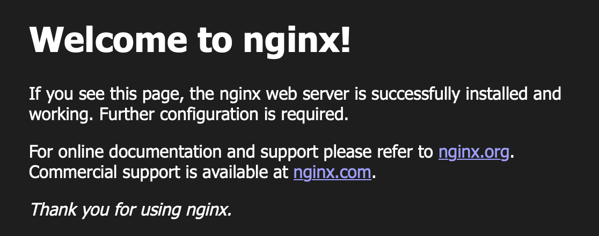

# AWS Infrastructure with Terraform

## 概要
このリポジトリは、Terraformを用いてAWS上にNginx Webサーバーを構築するポートフォリオです。IaCスキルとAWSの基本構成に関する理解をアピールする目的で作成しました。

- **目的**: IaCスキルとAWSネットワーク構成の理解を示すためのポートフォリオ  
- **対象者**: SRE・インフラエンジニア職志望
---
## 使用技術
- Terraform v1.x
- AWS（EC2,VPC,ALB,SGなど）
- Amazon Linux 2
- Nginx
---
## 構成図

## インフラ構成
| リソース           | 概要                                                       |
|--------------------|------------------------------------------------------------|
| VPC                | CIDR `10.0.0.0/16` のカスタムVPCを作成                      |
| Subnet             | パブリックサブネットを2つ作成（AZ: a, c）でマルチAZ構成を意識   |
| Internet Gateway   | VPCをインターネットに接続するためのIGW                      |
| Route Table        | IGWへのルート（0.0.0.0/0）を設定し、各サブネットに紐付け        |
| Security Group     | HTTP(80), HTTPS(443), SSH(22) のインバウンドを許可            |
| Key Pair           | EC2へSSH接続するための鍵を作成し利用                         |
| EC2                | Amazon Linux 2（Nginxインストール済み）のWebサーバー         |
| ALB                | パブリックALBを構成し、リクエストをEC2へ転送                 |
| Target Group       | EC2インスタンスを登録してALBからのトラフィックを受信         |
| Listener           | HTTPリクエストをTarget Groupにルーティング                   |
| Output             | ALBのDNS名、EC2のパブリックIPなどを出力                      |
| Variables          | リージョンやCIDRなど、変更しやすいように変数として定義         |
---
## なぜこの構成にしたか
この構成は、以下のような理由で設計しました：

- **VPC/Subnet**：
基本的なパブリックネットワーク構成の理解を深めるため、最小構成のカスタムVPCを自前で構築。

- **Internet Gateway/Route Table**：
パブリックサブネットからのインターネット通信を可能にするために設置しました。ネットワーク構成とルーティング設定の基本を理解するための構成です。

- **マルチAZ構成**： 
高可用性の基礎を学ぶため、異なるAZにパブリックサブネットを分けて配置しました。

- **ALB+EC2構成**：
Webサービスの基本構成を学ぶために採用。ALBによる負荷分散や可用性の考え方を理解することを目的としています。

- **Security Group**：
必要最小限の通信（HTTP, SSH）のみを許可し、AWSにおける基本的なアクセス制御やセキュリティ設計を学ぶことを目的としています。

- **Key Pair**：
EC2インスタンスにSSHで接続する仕組みを体験的に理解するために使用しました。AWSの認証方式や公開鍵認証の基本理解が目的です。

- **Target Group**：
ALBとEC2間のトラフィック振り分けの仕組みを学ぶため、ターゲットグループを使用してEC2を登録しました。ロードバランサーとバックエンド間の連携構成の基本を意識しています。

- **Terraform使用**: IaCの習得と再現性のある構築・破棄を可能にするため。
---
## セットアップ手順
# 1. terraform init
以下は `terraform init` を実行した際のスクリーンショットです。初期化が正常に完了したことが確認できます。

# 2. terraform plan
以下は `terraform plan` を実行した際の出力結果です。

## Terraform plan実行結果について
本リポジトリに含まれるTerraformの実行計画（plan）の主要な出力結果は、こちらのREADMEにて必要な部分のみ抜粋して記載しています。  
より詳細な出力内容につきましては、同梱の「plan-result.txt」ファイルに保存しておりますので、そちらをご参照ください。:
[plan-result.txt](./plan-result.txt)

# 3. 出力されたALBのDNS名にアクセス
以下は、デプロイが完了後、Nginxが正常に稼働していることを確認できました。

