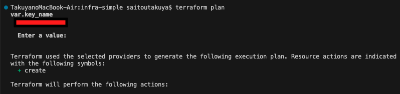
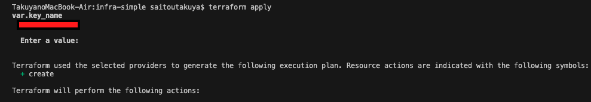
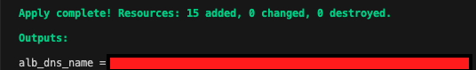

## 概要 
このリポジトリは、Terraformを用いてAWS上にNginxを構築するポートフォリオです。IaCスキルとAWSの基本構成に関する理解をアピールする目的で作成しました。
---
## 使用技術
- Terraform v1.x
- AWS（EC2,VPC,ALB,SGなど）
- Amazon Linux 2
- Nginx
---
## 構成図


## インフラ構成
| リソース           | 概要                                                       |
|--------------------|------------------------------------------------------------|
| VPC                | CIDR `10.0.0.0/16` のカスタムVPCを作成                      |
| Subnet             | パブリックサブネットを2つ作成（AZ: a, c）でマルチAZ構成を意識   |
| Internet Gateway   | VPCをインターネットに接続するためのIGW                      |
| Route Table        | IGWへのルート（0.0.0.0/0）を設定し、各サブネットに紐付け        |
| Security Group     | HTTP(80), HTTPS(443), SSH(22) のインバウンドを許可            |
| Key Pair           | EC2へSSH接続するための鍵を作成し利用                         |
| EC2                | Amazon Linux 2（Nginxインストール済み）のWebサーバー         |
| ALB                | パブリックALBを構成し、リクエストをEC2へ転送                 |
| Target Group       | EC2インスタンスを登録してALBからのトラフィックを受信         |
| Listener           | HTTPリクエストをTarget Groupにルーティング                   |
| Output             | ALBのDNS名、EC2のパブリックIPなどを出力                      |
| Variables          | リージョンやCIDRなど、変更しやすいように変数として定義         |
---
## なぜこの構成にしたか
この構成は、以下のような理由で設計しました：

- **VPC/Subnet**：
基本的なパブリックネットワーク構成の理解を深めるため、最小構成のカスタムVPCを自前で構築。

- **Internet Gateway/Route Table**：
パブリックサブネットからのインターネット通信を可能にするために設置しました。ネットワーク構成とルーティング設定の基本を理解するための構成です。

- **マルチAZ構成**： 
高可用性の基礎を学ぶため、異なるAZにパブリックサブネットを分けて配置しました。

- **ALB+EC2構成**：
Webサービスの基本構成を学ぶために採用。ALBによる負荷分散や可用性の考え方を理解することを目的としています。

- **Security Group**：
必要最小限の通信（HTTP, SSH）のみを許可し、AWSにおける基本的なアクセス制御やセキュリティ設計を学ぶことを目的としています。

- **Key Pair**：
EC2インスタンスにSSHで接続する仕組みを体験的に理解するために使用しました。AWSの認証方式や公開鍵認証の基本理解が目的です。

- **Target Group**：
ALBとEC2間のトラフィック振り分けの仕組みを学ぶため、ターゲットグループを使用してEC2を登録しました。ロードバランサーとバックエンド間の連携構成の基本を意識しています。

- **Terraform使用**: IaCの習得と再現性のある構築・破棄を可能にするため。
---
## ディレクトリ構成
```
infra-simple/
├── main.tf          # インフラ全体のリソース定義ファイル（VPC、EC2、ALBなど）
├── variables.tf     # 変数定義ファイル（パラメータ化して再利用性を高める）
├── outputs.tf       # 出力値定義ファイル（ALBのDNS名などを表示させる）
├── plan-result.txt  # `terraform plan` 実行結果のログ（変更内容の確認用）
├── apply-result.txt # `terraform apply` 実行結果のログ（適用内容の記録用）
└── README.md        # プロジェクトの概要・構成・使い方などを記載したドキュメント
```

---
## セットアップ手順
# 1. terraform init
以下は `terraform init` を実行した際のスクリーンショットです。初期化が正常に完了したことが確認できます。


# 2. terraform plan
以下は `terraform plan` を実行した際の出力結果です。※セキュリティの都合上、一部機密情報（キーペア名など）はマスクしています。



## Terraform plan実行結果について
本リポジトリに含まれるTerraformの実行計画（plan）の主要な出力結果は、こちらのREADMEにて必要な部分のみ抜粋して記載しています。  
より詳細な出力内容につきましては、同梱の「plan-result.txt」ファイルに保存しておりますので、こちらをご参照ください。:
[plan-result.txt](./plan-result.txt)

# 3. terraform apply
以下は `terraform apply` を実行した際のスクリーンショットです。



無事、applyに成功したことを確認できます。※セキュリティの都合上、一部機密情報（キーペア名など）はマスクしています。



# 4. 構築した環境の動作確認
構築が完了した後、ALBのDNS名にアクセスすることで、Nginxのデフォルトページが表示されることを確認しました。


## 動作確認

### VPC構成の確認（AWS CLI）
以下のコマンドを使用して、VPCが `10.0.0.0/16` で正しく作成されていることを確認しました。
```bash
aws ec2 describe-vpcs --filters "Name=cidr,Values=10.0.0.0/16" > outputs/vpc-result.txt
``` 
詳細なコマンド出力は以下のファイルに記載しています：

[vpc-result.txt](./outputs/vpc-result.txt)

### IGW構成の確認（AWS CLI）
以下のコマンドを使用して、Internet Gatewayが指定のVPCに正しくアタッチされていることを確認しました。
``` bash
aws ec2 describe-internet-gateways --filters "Name=attachment.vpc-id,Values=vpc-***" > outputs/igw-result.txt
```
詳細なコマンド出力は以下のファイルに記載しています：

[igw-result.txt](./outputs/igw-result.txt)

### Route Tableの構成確認（AWS CLI）
以下のコマンドを使用して、作成されたルートテーブルが、指定したVPCに正しく関連付けられており、意図したルートおよびタグが設定されていることを確認しました。
``` bash
aws ec2 describe-route-tables --filters "Name=vpc-id,Values=vpc-xxx" > outputs/route-table.txt
```
詳細なコマンド出力は以下のファイルに記載しています：

[route-table.txt](./outputs/route-table.txt)

### Security Group構成確認（AWS CLI）
以下のコマンドを使用して、作成されたセキュリティグループが、指定したVPCに正しく関連付けられており、意図したインバウンド／アウトバウンドルール（HTTP, SSH 等）やタグが設定されていることを確認しました。
``` bash
aws ec2 describe-security-groups --filters "Name=group-name,Values=sre-demo-web-sg"
```
詳細なコマンド出力は以下のファイルに記載しています：

[sg-result.txt](./outputs/sg-result.txt)

