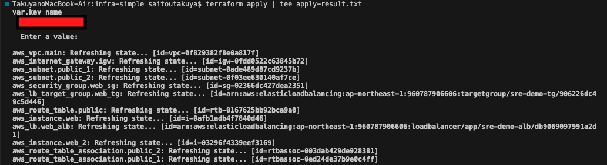

# AWS Infrastructure with Terraform

## 概要
このリポジトリは、Terraformを用いてAWS上にNginx Webサーバーを構築するポートフォリオです。IaCスキルとAWSの基本構成に関する理解をアピールする目的で作成しました。

- **目的**: IaCスキルとAWSネットワーク構成の理解を示すためのポートフォリオ  
- **対象者**: SRE・インフラエンジニア職志望

---

## インフラ構成

| リソース                 | 内容                                         |
| -------------------- | ------------------------------------------ |
| **VPC**              | カスタムVPC（CIDR `10.0.0.0/16`）             |
| **Subnet**           | パブリックサブネット×2（AZ: `a`, `c`）                 |
| **Internet Gateway** | VPCをインターネットへ接続                             |
| **Route Table**      | パブリックサブネットに 0.0.0.0/0 向けルート（IGW経由）         |
| **Security Group**   | HTTP(80), HTTPS(443), SSH(22)などを許可         |
| **Key Pair**         | EC2インスタンスへのSSH接続用キー                        |
| **EC2**              | Amazon Linux 2 + Nginx等インストール済み Webサーバー    |
| **ALB**              | Application Load Balancer（パブリック向け、マルチAZ構成） |
| **Target Group**     | EC2インスタンスを登録し、ALBからのトラフィックを受信              |
| **Listener**         | ALBのHTTPリクエストをターゲットグループに転送                 |
| **Output**           | ALB DNS名やEC2のIPなど、確認用に出力                   |
| **Variables**        | 各種パラメータ（リージョン、CIDR、プロジェクト名など）を外部変数化        |

---

## 使用技術

- Terraform v1.x
- AWS（EC2 / VPC / ALB / SG など）
- Amazon Linux 2
- Nginx

---

## 構成図

## デプロイ手順
# 1. terraform init
以下は `terraform init` を実行した際のスクリーンショットです。初期化が正常に完了したことが確認できます。

# 2. terraform plan
以下は `terraform plan` を実行した際の出力結果です。キーペア名（`var.key_name`）を入力するプロンプトが表示されました。
ここで、使用したい EC2 キーペア名を入力すると、Terraform はリソース作成の計画を出力します。
その後、表示される計画の一部です（`+ create` は作成予定のリソース）

## Terraform plan実行結果について
本リポジトリに含まれるTerraformの実行計画（plan）の主要な出力結果は、こちらのREADMEにて必要な部分のみ抜粋して記載しています。  
より詳細な出力内容につきましては、同梱の「plan-result.txt」ファイルに保存しておりますので、そちらをご参照ください。:
[plan-result.txt](./plan-result.txt)

# 3. 出力されたALBのDNS名にアクセス
以下は、デプロイが完了後、Nginxが正常に稼働していることを確認できました。

